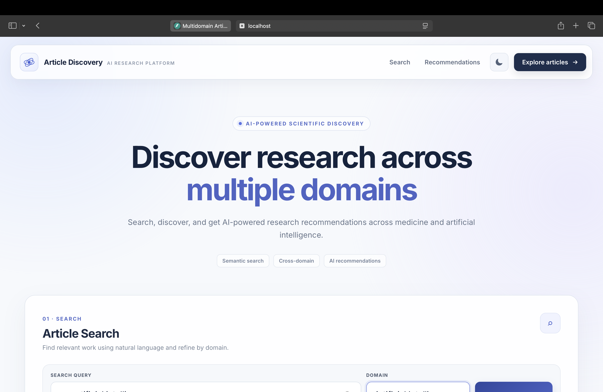
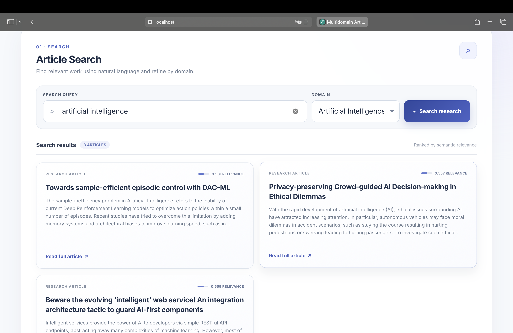
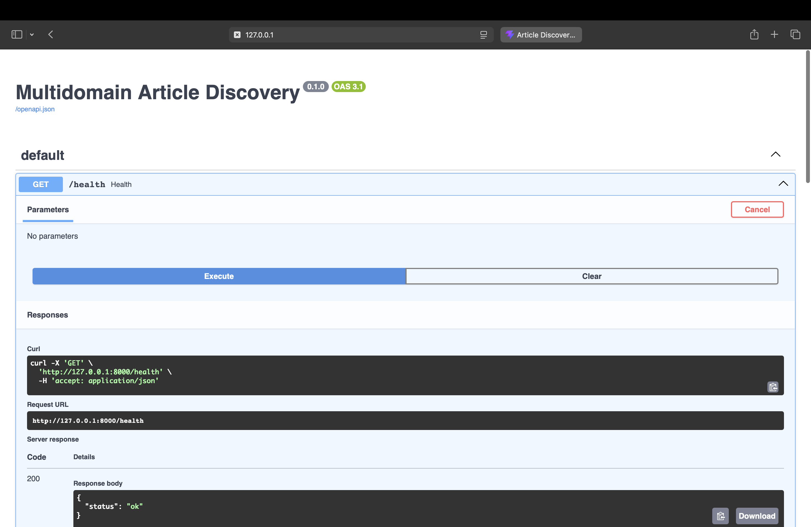

# Multidomain Article Discovery

AI-powered platform for semantic scientific article discovery and personalized recommendations across multiple domains.

## Features

- Semantic search using BGE-M3 embeddings
- Optional cross-encoder reranking with fallback to semantic similarity
- Personalized article recommendations
- PostgreSQL + pgvector vector search
- arXiv and PubMed ingestion
- FastAPI backend
- React + TypeScript frontend
- Dockerized backend

## Architecture

arXiv / PubMed  
→ ingestion  
→ normalization + deduplication  
→ embeddings  
→ PostgreSQL + pgvector  
→ semantic retrieval  
→ optional reranking  
→ FastAPI  
→ React frontend

## Tech Stack

### Backend
- Python
- FastAPI
- SQLAlchemy
- PostgreSQL
- pgvector

### AI
- BGE-M3
- BGE reranker
- Sentence Transformers
- PyTorch

### Frontend
- React
- TypeScript
- Vite

### Infrastructure
- Docker

## Screenshots

### Frontend

### Semantic Search

### FastAPI

## Current Status

The MVP is fully functional locally through the FastAPI backend and React frontend.

Cloud deployment was tested successfully at the service level, but transformer model memory requirements exceed practical free-tier hosting limits for full inference.

## Future Improvements

- Production deployment using higher-memory CPU/GPU infrastructure
- Scheduled article ingestion
- Automatic data refresh
- Additional scientific domains
- Advanced retrieval and recommendation evaluation